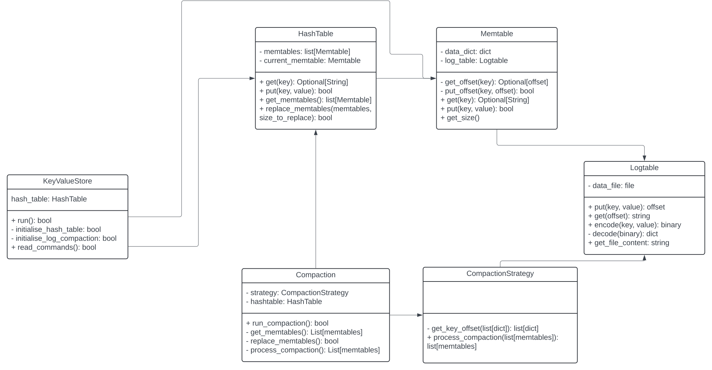
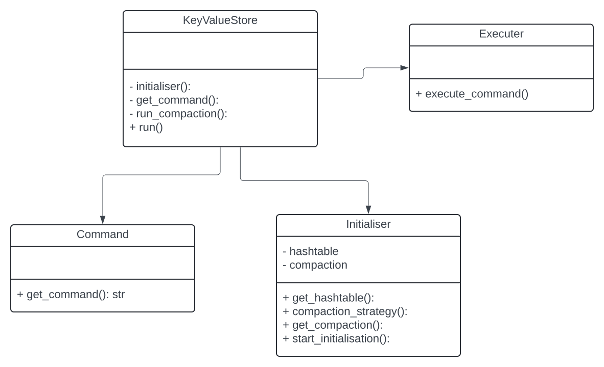

<br />
<div align="center">


<h3 align="center">Key Value Store</h3>

  <p align="center">
    An LSM Tree based Database
  </p>
</div>


<!-- ABOUT THE PROJECT -->
## About The Project


Implemented a LSM Tree based Key Value Store, which stores the data on disk, and have an compaction strategy.


<!-- GETTING STARTED -->
## Getting Started

This is an example of how you may give instructions on setting up your project locally.
To get a local copy up and running follow these simple example steps.

### Prerequisites

Install Python3.7+

<!-- USAGE EXAMPLES -->
## Usage

1. Clone the repository.
2. Run the key value store with command 
   ```sh
   python3 -m src.key_value_store.key_value_store
   ```
3. Run the client in another terminal with command
   ```sh
   python3 -m client.client
   ```
4. Use commands such as `SET key value`, `GET key` to interact with the key value store.

<!-- ROADMAP -->
## Roadmap

- [ ] Client is very basic, need to add 2 layer of connection protocol.
  - [ ] First layer authentication and authorization.
  - [ ] Second layer data transfer.
- [ ] Improve the key value store to use SSM Table.
- [ ] Add more compaction strategies.
- [ ] Add support for config files
- [ ] Add support for logging. (Currently using print)

<!-- Low Level Design -->
## Low Level Design

### Core UML Diagram




### Execute UML Diagram

